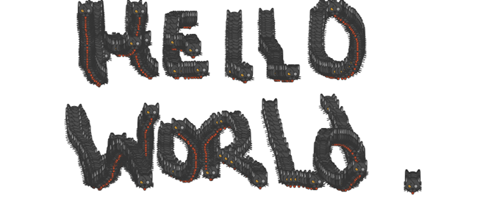

# CatPaint
This is the result of tests I did with html5 canvas:A simple webpage that allows to paint with cat emojis on a html5 reactive canvas.
It demonstrate the use of resisable canvas together with click listener while avoiding aspect ratio problems. Also I deployed it on a firebase project to learn how to do so and to share it. you can access it at:

[https://catpaint-89d4e.firebaseapp.com/](https://catpaint-89d4e.firebaseapp.com/)

You can edit and do as you please with those files. Also you can have fun painting cats with cats ;-) 

Enjoy !

